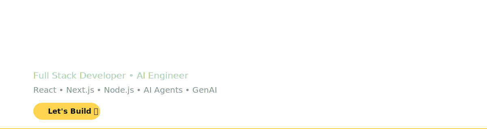

<p align="center">



</p>

<h1 align="center">
Hi 👋 I'm Simran Jaiswal
</h1>

<h3 align="center">

Software Developer @ Optum

</h3>

<p align="center">

Full Stack Developer • AI Engineer

</p>

<p align="center">


</p>

---

## 💫 About Me

```typescript
const simran = {

company: "Optum",

role: "Software Developer",

location: "India",

experience: "Full Stack Development",

workingOn: [

"AI Agents",

"GenAI",

"React",

"Next.js",

"Node.js"

],

currentlyLearning: [

"Advanced AI Agents",

"LLMs",

"System Design"

],

funFact:

"I love combining AI with modern web technologies."

}
```

---

## ⚡ Tech Stack

<p align="center">


</p>

---


# 🚀 What I Do

<table>
<tr>

<td width="50%">

### 💻 Full Stack Development

- ⚛️ React.js
- ▲ Next.js
- 🟢 Node.js
- 🚀 REST APIs
- 📱 Responsive UI
- ⚡ Performance Optimization

</td>

<td width="50%">

### 🤖 AI Engineering

- AI Agents
- LLM Applications
- Prompt Engineering
- AI Automation
- GenAI Solutions
- Intelligent Workflows

</td>

</tr>
</table>

---

# 📊 GitHub Dashboard

<p align="center">


</p>

<p align="center">


</p>

---

# 🏆 GitHub Achievements

<p align="center">


</p>

---

# 📈 Contribution Graph

<p align="center">


</p>

---

# ⚡ Current Focus

<div align="center">

| 🚀 Building | 📚 Learning | 🎯 Goal |
|:-----------|:------------|:---------|
| AI Agents | Advanced LLMs | Production AI Systems |
| Full Stack Apps | System Design | Scalable Architecture |
| Modern UI | Cloud Technologies | Open Source |

</div>

---

# 💼 Experience

## 🏢 Software Developer — Optum

✔️ Building enterprise healthcare applications

✔️ Developing scalable React & Next.js applications

✔️ Designing backend APIs using Node.js

✔️ Working on AI-powered solutions & AI Agents

✔️ Improving performance and developer experience

---

# 🧠 Core Skills

<div align="center">

| Frontend | Backend | Database | AI | Cloud |
|-----------|-----------|-----------|-----------|-----------|
| React | Node.js | MongoDB | AI Agents | AWS |
| Next.js | Express | PostgreSQL | GenAI | Vercel |
| Redux | REST APIs | Prisma | LLMs | GitHub Actions |
| TypeScript | Authentication | SQL | Automation | Docker |

</div>

---


# 🚀 Featured Projects

<table>

<tr>

<td width="50%">

### 🤖 AI Agent Platform

Modern AI agent workflows powered by LLMs and intelligent automation.

**Tech Stack**

`React` `Next.js` `Node.js` `OpenAI`

<a href="https://github.com/simran-jaiswal/YOUR_REPO">

</a>

</td>

<td width="50%">

### 📜 Certificate Platform

Dynamic certificate generation with authentication, payments and automation.

**Tech Stack**

`React` `Node.js` `MongoDB`

<a href="https://github.com/simran-jaiswal/YOUR_REPO">

</a>

</td>

</tr>

<tr>

<td width="50%">

### 📊 Admin Dashboard

Enterprise dashboard with analytics, authentication and role-based access.

**Tech Stack**

`React` `Redux` `Material UI`

<a href="https://github.com/simran-jaiswal/YOUR_REPO">

</a>

</td>

<td width="50%">

### 🛒 Full Stack MERN App

Modern scalable MERN application with responsive UI.

**Tech Stack**

`MongoDB` `Express` `React` `Node`

<a href="https://github.com/simran-jaiswal/YOUR_REPO">

</a>

</td>

</tr>

</table>

---


# 📫 Let's Connect

<div align="center">

<a href="https://www.linkedin.com/in/simran-jaiswal/">

</a>

&nbsp;

<a href="mailto:simranjaiswal1212@gmail.com">

</a>

&nbsp;

<a href="https://github.com/simran-jaiswal">

</a>

</div>

---

# 📈 Profile Metrics

<div align="center">


</div>

---

# 💬 Favorite Quote

<div align="center">

> **"Build with purpose. Learn continuously. Ship with confidence."**

</div>

---

<div align="center">

### ⭐ Thanks for visiting my profile!


</div>
