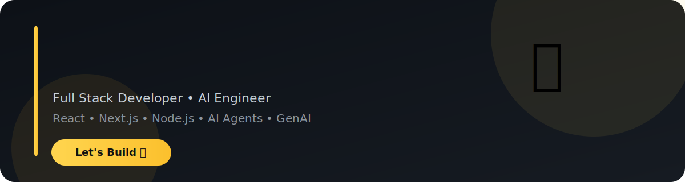

 

# 👋 Hi, I'm Simran Jaiswal

### Software Developer @ Optum • Full Stack Developer • AI Engineer

 

  

---

# 🚀 About Me

<table>
<tr>

<td width="40%">

</td>

<td width="60%">

### 👩 About

- 💼 Software Developer @ **Optum**
- ⚛️ Full Stack Developer
- 🤖 AI Engineer
- 🚀 Building AI Agents
- ☁️ Cloud & Modern Web Applications
- 📍 India 🇮🇳

### 🌱 Currently Learning

- Advanced AI Agents
- LLM Applications
- RAG
- LangGraph
- System Design

### ⚡ Interests

- Artificial Intelligence
- Enterprise Software
- Modern Web Technologies
- Clean Architecture
- Performance Optimization

</td>

</tr>
</table>

---

# ⚡ Tech Stack

---

# 📊 GitHub Analytics

---

# 📈 Contribution Graph

---

# 🏆 GitHub Achievements

---

# 🤖 AI & Full Stack Expertise

---

# 🚀 Featured Projects

---

# 🐍 Contribution Snake

---

# 📫 Connect With Me

